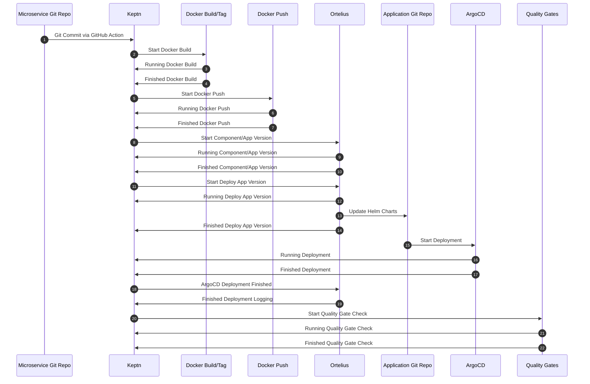

1) GitHub Keptn #1 - Utkarsh, Sacha
2) Docker Keptn #2 thru #7 - Steve
3) Ortelius Keptn #8 thru #14 - Steve, Joseph
4) ArgoCD Ketpn #15 thru #19 - Brad, Meha
5) Keptn Quality Gates #20 thru #22 - Brad, Arvind

Reviewer - Tony

Tuesday 8/23 - Discord Check In Status

1. Overall process summary
2. How does the event work?
3. What does the event contain?
4. Security concerns

# Github-Keptn Flow

## Requirement

To analyse how to achive github-keptn communication whenevern there is a commit.

## Scenario

- Code Commit for the first time
- Sebsequent Code Commit

## Approach

- Using Keptn as a task in the CI pipeline(which will be triggered automatically for every commit)
- Using Github action to send the meta data information to keptn-ortelius service. keptn-ortelius will internally use those service to make a call to either ortelius or keptn using APIs.
- Using Active and Passive Webhooks integration on Keptn with Github APIs. Ref:- https://artifacthub.io/packages/keptn/keptn-integrations/githubaction

## Event Contract

```
{
  "datacontenttype": "string",
  "data": {},
  "id": "string",
  "source": "string",
  "specversion": "string",
  "time": "string",
  "triggeredid": "string",
  "type": "string"
}
```

## Data Schema

<details>
  <summary>
    Click to View Schema
  </summary>

```json
{
  "title": "Commit",
  "description": "Commit",
  "type": "object",
  "properties": {
    "url": {
      "type": "string",
      "format": "uri",
      "examples": [
        "https://api.github.com/repos/octocat/Hello-World/commits/6dcb09b5b57875f334f61aebed695e2e4193db5e"
      ]
    },
    "sha": {
      "type": "string",
      "examples": ["6dcb09b5b57875f334f61aebed695e2e4193db5e"]
    },
    "node_id": {
      "type": "string",
      "examples": [
        "MDY6Q29tbWl0NmRjYjA5YjViNTc4NzVmMzM0ZjYxYWViZWQ2OTVlMmU0MTkzZGI1ZQ=="
      ]
    },
    "html_url": {
      "type": "string",
      "format": "uri",
      "examples": [
        "https://github.com/octocat/Hello-World/commit/6dcb09b5b57875f334f61aebed695e2e4193db5e"
      ]
    },
    "comments_url": {
      "type": "string",
      "format": "uri",
      "examples": [
        "https://api.github.com/repos/octocat/Hello-World/commits/6dcb09b5b57875f334f61aebed695e2e4193db5e/comments"
      ]
    },
    "commit": {
      "type": "object",
      "properties": {
        "url": {
          "type": "string",
          "format": "uri",
          "examples": [
            "https://api.github.com/repos/octocat/Hello-World/commits/6dcb09b5b57875f334f61aebed695e2e4193db5e"
          ]
        },
        "author": {
          "anyOf": [
            {
              "type": "null"
            },
            {
              "title": "Git User",
              "description": "Metaproperties for Git author/committer information.",
              "type": "object",
              "properties": {
                "name": {
                  "type": "string",
                  "examples": ["\"Chris Wanstrath\""]
                },
                "email": {
                  "type": "string",
                  "examples": ["\"chris@ozmm.org\""]
                },
                "date": {
                  "type": "string",
                  "examples": ["\"2007-10-29T02:42:39.000-07:00\""]
                }
              }
            }
          ]
        },
        "committer": {
          "anyOf": [
            {
              "type": "null"
            },
            {
              "title": "Git User",
              "description": "Metaproperties for Git author/committer information.",
              "type": "object",
              "properties": {
                "name": {
                  "type": "string",
                  "examples": ["\"Chris Wanstrath\""]
                },
                "email": {
                  "type": "string",
                  "examples": ["\"chris@ozmm.org\""]
                },
                "date": {
                  "type": "string",
                  "examples": ["\"2007-10-29T02:42:39.000-07:00\""]
                }
              }
            }
          ]
        },
        "message": {
          "type": "string",
          "examples": ["Fix all the bugs"]
        },
        "comment_count": {
          "type": "integer",
          "examples": [0]
        },
        "tree": {
          "type": "object",
          "properties": {
            "sha": {
              "type": "string",
              "examples": ["827efc6d56897b048c772eb4087f854f46256132"]
            },
            "url": {
              "type": "string",
              "format": "uri",
              "examples": [
                "https://api.github.com/repos/octocat/Hello-World/tree/827efc6d56897b048c772eb4087f854f46256132"
              ]
            }
          },
          "required": ["sha", "url"]
        },
        "verification": {
          "title": "Verification",
          "type": "object",
          "properties": {
            "verified": {
              "type": "boolean"
            },
            "reason": {
              "type": "string"
            },
            "payload": {
              "type": ["string", "null"]
            },
            "signature": {
              "type": ["string", "null"]
            }
          },
          "required": ["verified", "reason", "payload", "signature"]
        }
      },
      "required": [
        "author",
        "committer",
        "comment_count",
        "message",
        "tree",
        "url"
      ]
    },
    "author": {
      "anyOf": [
        {
          "type": "null"
        },
        {
          "title": "Simple User",
          "description": "Simple User",
          "type": "object",
          "properties": {
            "name": {
              "type": ["string", "null"]
            },
            "email": {
              "type": ["string", "null"]
            },
            "login": {
              "type": "string",
              "examples": ["octocat"]
            },
            "id": {
              "type": "integer",
              "examples": [1]
            },
            "node_id": {
              "type": "string",
              "examples": ["MDQ6VXNlcjE="]
            },
            "avatar_url": {
              "type": "string",
              "format": "uri",
              "examples": ["https://github.com/images/error/octocat_happy.gif"]
            },
            "gravatar_id": {
              "type": ["string", "null"],
              "examples": ["41d064eb2195891e12d0413f63227ea7"]
            },
            "url": {
              "type": "string",
              "format": "uri",
              "examples": ["https://api.github.com/users/octocat"]
            },
            "html_url": {
              "type": "string",
              "format": "uri",
              "examples": ["https://github.com/octocat"]
            },
            "followers_url": {
              "type": "string",
              "format": "uri",
              "examples": ["https://api.github.com/users/octocat/followers"]
            },
            "following_url": {
              "type": "string",
              "examples": [
                "https://api.github.com/users/octocat/following{/other_user}"
              ]
            },
            "gists_url": {
              "type": "string",
              "examples": [
                "https://api.github.com/users/octocat/gists{/gist_id}"
              ]
            },
            "starred_url": {
              "type": "string",
              "examples": [
                "https://api.github.com/users/octocat/starred{/owner}{/repo}"
              ]
            },
            "subscriptions_url": {
              "type": "string",
              "format": "uri",
              "examples": ["https://api.github.com/users/octocat/subscriptions"]
            },
            "organizations_url": {
              "type": "string",
              "format": "uri",
              "examples": ["https://api.github.com/users/octocat/orgs"]
            },
            "repos_url": {
              "type": "string",
              "format": "uri",
              "examples": ["https://api.github.com/users/octocat/repos"]
            },
            "events_url": {
              "type": "string",
              "examples": [
                "https://api.github.com/users/octocat/events{/privacy}"
              ]
            },
            "received_events_url": {
              "type": "string",
              "format": "uri",
              "examples": [
                "https://api.github.com/users/octocat/received_events"
              ]
            },
            "type": {
              "type": "string",
              "examples": ["User"]
            },
            "site_admin": {
              "type": "boolean"
            },
            "starred_at": {
              "type": "string",
              "examples": ["\"2020-07-09T00:17:55Z\""]
            }
          },
          "required": [
            "avatar_url",
            "events_url",
            "followers_url",
            "following_url",
            "gists_url",
            "gravatar_id",
            "html_url",
            "id",
            "node_id",
            "login",
            "organizations_url",
            "received_events_url",
            "repos_url",
            "site_admin",
            "starred_url",
            "subscriptions_url",
            "type",
            "url"
          ]
        }
      ]
    },
    "committer": {
      "anyOf": [
        {
          "type": "null"
        },
        {
          "title": "Simple User",
          "description": "Simple User",
          "type": "object",
          "properties": {
            "name": {
              "type": ["string", "null"]
            },
            "email": {
              "type": ["string", "null"]
            },
            "login": {
              "type": "string",
              "examples": ["octocat"]
            },
            "id": {
              "type": "integer",
              "examples": [1]
            },
            "node_id": {
              "type": "string",
              "examples": ["MDQ6VXNlcjE="]
            },
            "avatar_url": {
              "type": "string",
              "format": "uri",
              "examples": ["https://github.com/images/error/octocat_happy.gif"]
            },
            "gravatar_id": {
              "type": ["string", "null"],
              "examples": ["41d064eb2195891e12d0413f63227ea7"]
            },
            "url": {
              "type": "string",
              "format": "uri",
              "examples": ["https://api.github.com/users/octocat"]
            },
            "html_url": {
              "type": "string",
              "format": "uri",
              "examples": ["https://github.com/octocat"]
            },
            "followers_url": {
              "type": "string",
              "format": "uri",
              "examples": ["https://api.github.com/users/octocat/followers"]
            },
            "following_url": {
              "type": "string",
              "examples": [
                "https://api.github.com/users/octocat/following{/other_user}"
              ]
            },
            "gists_url": {
              "type": "string",
              "examples": [
                "https://api.github.com/users/octocat/gists{/gist_id}"
              ]
            },
            "starred_url": {
              "type": "string",
              "examples": [
                "https://api.github.com/users/octocat/starred{/owner}{/repo}"
              ]
            },
            "subscriptions_url": {
              "type": "string",
              "format": "uri",
              "examples": ["https://api.github.com/users/octocat/subscriptions"]
            },
            "organizations_url": {
              "type": "string",
              "format": "uri",
              "examples": ["https://api.github.com/users/octocat/orgs"]
            },
            "repos_url": {
              "type": "string",
              "format": "uri",
              "examples": ["https://api.github.com/users/octocat/repos"]
            },
            "events_url": {
              "type": "string",
              "examples": [
                "https://api.github.com/users/octocat/events{/privacy}"
              ]
            },
            "received_events_url": {
              "type": "string",
              "format": "uri",
              "examples": [
                "https://api.github.com/users/octocat/received_events"
              ]
            },
            "type": {
              "type": "string",
              "examples": ["User"]
            },
            "site_admin": {
              "type": "boolean"
            },
            "starred_at": {
              "type": "string",
              "examples": ["\"2020-07-09T00:17:55Z\""]
            }
          },
          "required": [
            "avatar_url",
            "events_url",
            "followers_url",
            "following_url",
            "gists_url",
            "gravatar_id",
            "html_url",
            "id",
            "node_id",
            "login",
            "organizations_url",
            "received_events_url",
            "repos_url",
            "site_admin",
            "starred_url",
            "subscriptions_url",
            "type",
            "url"
          ]
        }
      ]
    },
    "parents": {
      "type": "array",
      "items": {
        "type": "object",
        "properties": {
          "sha": {
            "type": "string",
            "examples": ["7638417db6d59f3c431d3e1f261cc637155684cd"]
          },
          "url": {
            "type": "string",
            "format": "uri",
            "examples": [
              "https://api.github.com/repos/octocat/Hello-World/commits/7638417db6d59f3c431d3e1f261cc637155684cd"
            ]
          },
          "html_url": {
            "type": "string",
            "format": "uri",
            "examples": [
              "https://github.com/octocat/Hello-World/commit/7638417db6d59f3c431d3e1f261cc637155684cd"
            ]
          }
        },
        "required": ["sha", "url"]
      }
    },
    "stats": {
      "type": "object",
      "properties": {
        "additions": {
          "type": "integer"
        },
        "deletions": {
          "type": "integer"
        },
        "total": {
          "type": "integer"
        }
      }
    },
    "files": {
      "type": "array",
      "items": {
        "title": "Diff Entry",
        "description": "Diff Entry",
        "type": "object",
        "properties": {
          "sha": {
            "type": "string",
            "examples": ["bbcd538c8e72b8c175046e27cc8f907076331401"]
          },
          "filename": {
            "type": "string",
            "examples": ["file1.txt"]
          },
          "status": {
            "type": "string",
            "enum": [
              "added",
              "removed",
              "modified",
              "renamed",
              "copied",
              "changed",
              "unchanged"
            ],
            "examples": ["added"]
          },
          "additions": {
            "type": "integer",
            "examples": [103]
          },
          "deletions": {
            "type": "integer",
            "examples": [21]
          },
          "changes": {
            "type": "integer",
            "examples": [124]
          },
          "blob_url": {
            "type": "string",
            "format": "uri",
            "examples": [
              "https://github.com/octocat/Hello-World/blob/6dcb09b5b57875f334f61aebed695e2e4193db5e/file1.txt"
            ]
          },
          "raw_url": {
            "type": "string",
            "format": "uri",
            "examples": [
              "https://github.com/octocat/Hello-World/raw/6dcb09b5b57875f334f61aebed695e2e4193db5e/file1.txt"
            ]
          },
          "contents_url": {
            "type": "string",
            "format": "uri",
            "examples": [
              "https://api.github.com/repos/octocat/Hello-World/contents/file1.txt?ref=6dcb09b5b57875f334f61aebed695e2e4193db5e"
            ]
          },
          "patch": {
            "type": "string",
            "examples": [
              "@@ -132,7 +132,7 @@ module Test @@ -1000,7 +1000,7 @@ module Test"
            ]
          },
          "previous_filename": {
            "type": "string",
            "examples": ["file.txt"]
          }
        },
        "required": [
          "additions",
          "blob_url",
          "changes",
          "contents_url",
          "deletions",
          "filename",
          "raw_url",
          "sha",
          "status"
        ]
      }
    }
  },
  "required": [
    "url",
    "sha",
    "node_id",
    "html_url",
    "comments_url",
    "commit",
    "author",
    "committer",
    "parents"
  ]
}
```

</details>

&nbsp;

## Sample Contract

<details>
<summary>
Click to View Sample Contract
</summary>

```
{
  "contenttype": "text/json",
  "data": {
    "url": "https://api.github.com/repos/octocat/Hello-World/commits/6dcb09b5b57875f334f61aebed695e2e4193db5e",
    "sha": "6dcb09b5b57875f334f61aebed695e2e4193db5e",
    "node_id": "MDY6Q29tbWl0NmRjYjA5YjViNTc4NzVmMzM0ZjYxYWViZWQ2OTVlMmU0MTkzZGI1ZQ==",
    "html_url": "https://github.com/octocat/Hello-World/commit/6dcb09b5b57875f334f61aebed695e2e4193db5e",
    "comments_url": "https://api.github.com/repos/octocat/Hello-World/commits/6dcb09b5b57875f334f61aebed695e2e4193db5e/comments",
    "commit": {
      "url": "https://api.github.com/repos/octocat/Hello-World/git/commits/6dcb09b5b57875f334f61aebed695e2e4193db5e",
      "author": {
        "name": "Monalisa Octocat",
        "email": "support@github.com",
        "date": "2011-04-14T16:00:49Z"
      },
      "committer": {
        "name": "Monalisa Octocat",
        "email": "support@github.com",
        "date": "2011-04-14T16:00:49Z"
      },
      "message": "Fix all the bugs",
      "tree": {
        "url": "https://api.github.com/repos/octocat/Hello-World/tree/6dcb09b5b57875f334f61aebed695e2e4193db5e",
        "sha": "6dcb09b5b57875f334f61aebed695e2e4193db5e"
      },
      "comment_count": 0,
      "verification": {
        "verified": false,
        "reason": "unsigned",
        "signature": null,
        "payload": null
      }
    },
    "author": {
      "login": "octocat",
      "id": 1,
      "node_id": "MDQ6VXNlcjE=",
      "avatar_url": "https://github.com/images/error/octocat_happy.gif",
      "gravatar_id": "",
      "url": "https://api.github.com/users/octocat",
      "html_url": "https://github.com/octocat",
      "followers_url": "https://api.github.com/users/octocat/followers",
      "following_url": "https://api.github.com/users/octocat/following{/other_user}",
      "gists_url": "https://api.github.com/users/octocat/gists{/gist_id}",
      "starred_url": "https://api.github.com/users/octocat/starred{/owner}{/repo}",
      "subscriptions_url": "https://api.github.com/users/octocat/subscriptions",
      "organizations_url": "https://api.github.com/users/octocat/orgs",
      "repos_url": "https://api.github.com/users/octocat/repos",
      "events_url": "https://api.github.com/users/octocat/events{/privacy}",
      "received_events_url": "https://api.github.com/users/octocat/received_events",
      "type": "User",
      "site_admin": false
    },
    "committer": {
      "login": "octocat",
      "id": 1,
      "node_id": "MDQ6VXNlcjE=",
      "avatar_url": "https://github.com/images/error/octocat_happy.gif",
      "gravatar_id": "",
      "url": "https://api.github.com/users/octocat",
      "html_url": "https://github.com/octocat",
      "followers_url": "https://api.github.com/users/octocat/followers",
      "following_url": "https://api.github.com/users/octocat/following{/other_user}",
      "gists_url": "https://api.github.com/users/octocat/gists{/gist_id}",
      "starred_url": "https://api.github.com/users/octocat/starred{/owner}{/repo}",
      "subscriptions_url": "https://api.github.com/users/octocat/subscriptions",
      "organizations_url": "https://api.github.com/users/octocat/orgs",
      "repos_url": "https://api.github.com/users/octocat/repos",
      "events_url": "https://api.github.com/users/octocat/events{/privacy}",
      "received_events_url": "https://api.github.com/users/octocat/received_events",
      "type": "User",
      "site_admin": false
    },
    "parents": [
      {
        "url": "https://api.github.com/repos/octocat/Hello-World/commits/6dcb09b5b57875f334f61aebed695e2e4193db5e",
        "sha": "6dcb09b5b57875f334f61aebed695e2e4193db5e"
      }
    ]
  },
  "id": "A234-1234-1234",
  "source":  "https://github.com/cloudevents/spec/pull",
  "specversion": "1.0",
  "time": "2018-04-05T17:31:00Z",
  "triggeredid": "string",
  "type": "com.github.pull_request.opened"
}
```

</details>

